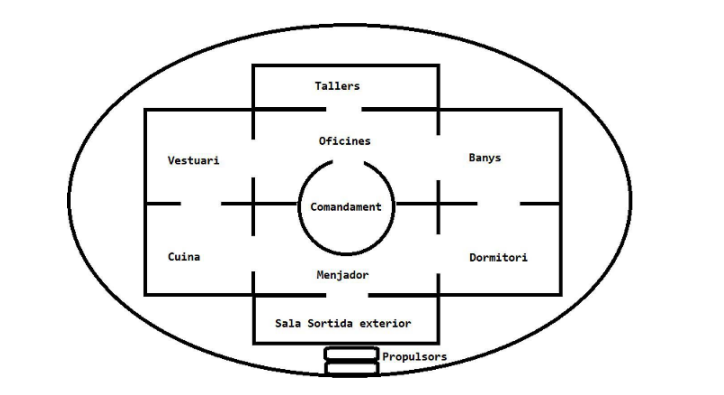

# 01. Història

L'any 2120, la nau **PiaXXII** viatja cap al planeta **SUMMEM**, on es busquen condicions adequades per iniciar una nova vida.

Després d'un llarg període d'hibernació, el capità Bond és despertat per **iHall**, l'ordinador de la nau.

La PiaXXII ha xocat amb un petit aeròlit i els propulsors han quedat danyats.

Bond haurà de recórrer la nau, aconseguir els objectes necessaris i arribar fins als propulsors per reparar-los.

La missió es complica per la presència de **Malien**, un alien que es mou per la nau.

# 02. Objectiu del joc

L'objectiu principal és **reparar els propulsors de la PiaXXII i continuar el viatge cap a SUMMEM**.

Per aconseguir-ho, el jugador ha d'explorar la nau, trobar els objectes necessaris i utilitzar-los en les situacions adequades.

La partida també inclou situacions de derrota relacionades amb Malien.

# 03. Zones

La nau té 10 zones:

1. **Comandament**
2. **Oficines**
3. **Tallers**
4. **Vestuari**
5. **Cuina**
6. **Menjador**
7. **Banys**
8. **Dormitori**
9. **Sala de Sortida Exterior**
10. **Propulsors**

Les zones estan connectades mitjançant diferents sortides.

